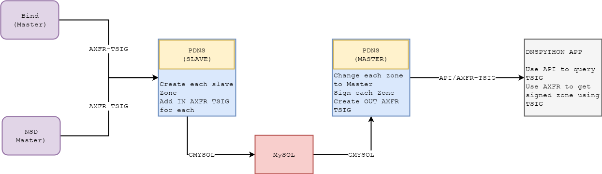

# Managed DNSSEC Docker Compose Poc with PowerDNS #

This lab is a proof of concept for Managed DNSSEC AFRINIC Labs project. 


## Design ##


For each container (except MySQL), there is a corresponding folder in the project. Each container has a dedicated IP.

### DNS Servers ###
Four authoritative DNS servers:
* **nsd** (NSD 4.1.27):
  - zone: `nsd.tld`. Zone file is in `etc/nsd/zones`.
  - Custom Dockerfile based on [Hardware](https://github.com/hardware/nsd-dnssec/blob/master/Dockerfile)
* **bind** (Bind, from alpine:3.9)
  - zone: `bind.tld`. Zone file is in `etc/bind/zones`.
  - Custom Dockerfile based on [ventz](https://github.com/ventz/docker-bind/blob/master/container/Dockerfile)
* **pdns_slave** (PowerDNS 4.1.7)
  - Connect and create shared MySQL database.
  - Custom Dockerfile based on [psi-4ward](https://github.com/psi-4ward/docker-powerdns/blob/master/Dockerfile)
  - Create zone and get zone records using signed AXFR.
* **pdns_authoritative** (PowerDNS 4.2.0-rc2; required for tsigkey API endpoints)
  - Fetch zones from shared MySQL database
  - Open `API` to sign zone from  **dns_api** requests.
  - Signed AXFR to **NS** in each zone file.

Each zone has two **NS**:
  - Pre signing out AXFR: Authoritative(`bind`/`nsd`) to slave (`pdns_slave`). `ns1` is `pdns_slave` IP.
  - Post signing out AXFR: Authoritative(`pdns_authoritative`) to slave (dns_api). `ns2` is `dns_api` IP.


#### Storage ####
One **shared_mysql** container from `mysql/mysql-server:5.7` image. MySQL Data and configurations (`bind`/`nsd`/`pdns_authoritative`/`pdns_slave`/`shared_mysql`) are saved to disk using docker volume from `etc` folder.


### DNS API ###
One **dns_api** to send request to **pdns_authoritative** `API`. Sign zone using `API` and get signed zone data using AXFR from `dnspython` package.

### How to ###
How to deploy the lab
* Clean some volume
```
docker volume rm poc_pdns_slave
docker volume rm poc_pdns_authoritative
```
* Build it
```
docker-compose build
```
* Run it
```
docker-compose up -d
```
* Connect to `dns_api`
```
docker exec -it dns_api /bin/sh
```
* Run python script
```
python managed_dnssec.py
```
