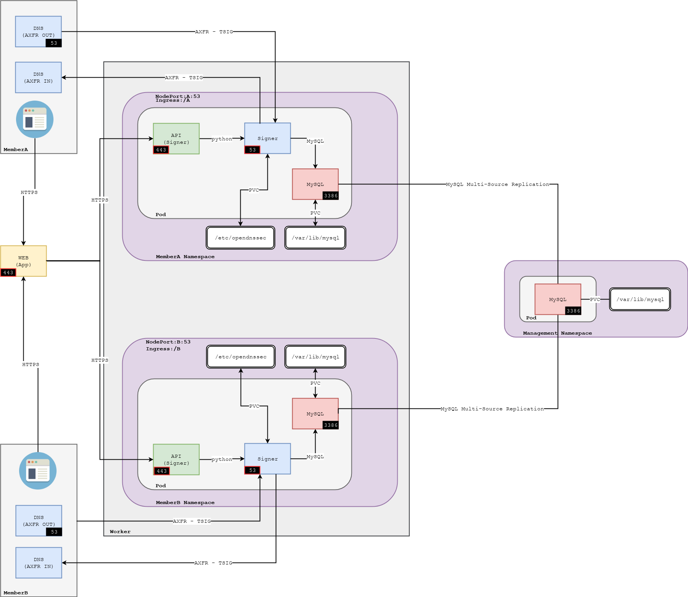

# Managed DNSSEC K8s Poc with OpenDNSSEC #

This lab is a proof of concept for Managed DNSSEC AFRINIC Labs project.


## Design ##



### Configs ###
* `Namespace`: each AFRINIC member will have a dedicated namespace. A `management` namespace will be used to replicate MySQL servers across the cluster.
* `ConfigMap`: variable use in environment by the docker-compose implementation are defined in k8s ConfigMap using key:value pair.
* `Secret`: sensitive information like MySQL password or SoftHSM parameters are hidden in a opaque object.
* `PersitentVolumeClaim`: MySQL or OpenDNSSEC data are saved and persited using a PVC.
* `Service`: MySQL deployment prepare a service, that is used by OpenDNSSEC deployment as Enforcer storage. Signer API (Flask) offer a http service that is use by `Ingress` to forward traffic to it. OpenDNSSEC offer a DNS service that is mapped to a `NodePort`. A special service relay is used to allow cross namepace access to the `Ingress`.


### Access ###
* **http**: each Signer API will use a subpath (`/api/v1/c01/(.*)`, `/api/v1/c02/(.*)`, etc) from an `Ingress` and the traffic will be redirected to the corresponding service (ie member API) in the cluster.
* **dns**: `NodePort` is used to attach each Signer DNS port (53) to a worker port on the cluster. Based o the port numer, the DNS traffic will be forwarded to the corresponding service (ie member signer) in the cluster.

### How to ###
How to deploy the lab
* Apply yaml config
```
kubectl apply -k monitoring
kubectl apply -k members
```
* Check is Pods are running for member 01
```
kubectl get pod,svc -n customer-01 
```
* Get all objects related to member 01 
```
kubectl get pod,svc,pv,pvc,configmap,secret -n customer-01 
```

### Next Steps ###
1. Configure master DNS server to allow zone transfert using TSIGKeys (AXFR Out)
2. Use Signer API Endpoints to:
 - Create TSIGKeys (for AXFR In and Out)
 - Create signing policy
 - Add zones using DNS adapter and created policy
3. Configure slave DNS server to request signed zone using TSIGKeys (AXFR Out)

