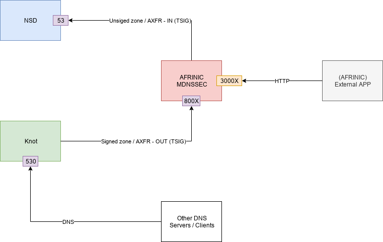
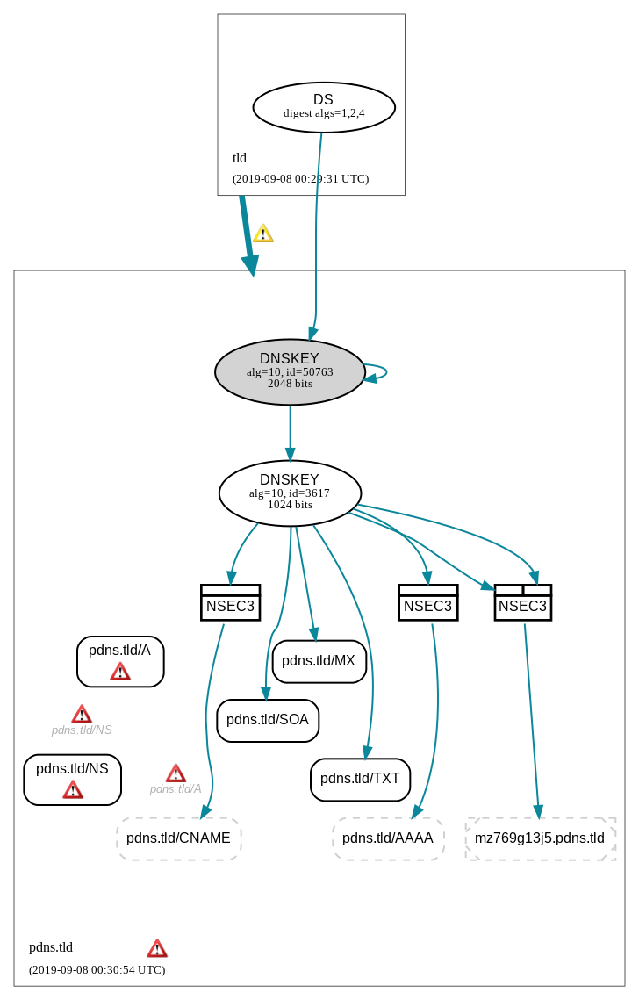

# Managed DNSSEC with Docker Swarm #

This lab is a proof of concept for Managed DNSSEC AFRINIC Labs project.


## Testing environment ##



### Deployment ###
With an Ansible playbook [`axfr_env.yml`](axfr_env.yml), we can deploy a testing environment. This playbook will:
* Install all dependencies for docker, docker-compose and docker swarm.
* Copy `project` folder on the host.
* Deploy docker-compose


### Prerequisites ###
AFRINIC member should configure their DNS primary server to allow signed TSIG zone transfer to AFRINIC dedicated DNS server for zone signing. For instance, `<afrinic_dns_ip>` in `project/etc/nsd/conf/nsd.conf` should be replace by AFRINIC DNS server. TSIG keys shoudl also be correclty created (ie `<nsd_slave_secret_key>`, `<bind_slave_secret_key>`,`<pdns_slave_secret_key>`). Of course, TSIG name  and algorithm could also be changed. But those changes have to be applied in the test application in `project/dnspython/app/dns_test.py`.

Signed zone will be transfered using TSIG to member DNS server. In our example, `project/etc/knot/config/knot.conf` required TSIG keys `<bind_master_secret_key>`, `<pdns_master_secret_key>`,`<nsd_master_secret_key>`. `<afrinic_dns_ip>` and `<afrinic_dns_port>` will be provided by AFRINIC for zone transfer.

AFRINIC will provide for zone transfer:
1. `<afrinic_dns_ip>`
2. `<afrinic_dns_port>`

AFRINIC could provide for API access:
1. `<afrinic_api_key>`
2. `<afrinic_api_ip_fqdn>`
3. `<afrinic_api_port>`

Member should provide:
1. zone name.
2. TSIG key(s) for zone transfer to AFRINIC DNS (name, algo, key).
3. Primary DNS IP for zone transfer to AFRINIC (`<member_primary_dns_ip>`/ `<member_primary_dns_port>`). In this lab, we use NSD as primary DNS.
4. TSIG key(s) for zone transfer from AFRINIC DNS (name, algo, key) to their DNS server.
5. Cryptokeys information (not yet implemented). In this test a KSK and a ZSK are created with following parameters:
    1. ksk
        1. "algorithm": "rsasha512"
        2. "bits": 2048
    2. zsk
        1. "algorithm": "rsasha512"
        2. "bits": 1024
5. Secondary DNS IP for zone transfer from AFRINIC (`<member_secondary_dns_ip>`/ `<member_secondary_dns_port>`). In this lab, we use Knot.


Keyroll are managed in PowerDNS for [ksk roll](https://doc.powerdns.com/authoritative/guides/kskroll.html) and [zsk](https://doc.powerdns.com/authoritative/guides/zskroll.html). NSEC3 parameters are set to **'1 0 1 ab'** according to [NSEC modes and parameters](https://doc.powerdns.com/authoritative/dnssec/operational.html#setting-the-nsec-modes-and-parameters).

### How to ###
0. Clone the repositry and change folder
```
git clone git@github.com:AFRINIC-Labs/managed-dnssec.git && cd managed-dnssec
```
1. Prepare vault authentication parameters
We assume that `remote_user` can use `sudo` on remote server. Remote server IP/domain is added to in `inventory` file ie replace `<test_server_ip_fqdn>` by the test server.

```
ansible-vault create group_vars/all/vault.yml

vault_ssh_pass: <remote_user_password>
vault_ssh_user: <remote_user>

```
2. Add vault password in file
```
echo "vault_super_password" > .vault_pass.txt
```
3. Add vault password file in ansible.cfg (it should be done already).
```
vim ansible.cfg

[defaults]
...
vault_password_file = ./.vault_pass.txt
...
```
4. Update environment variables in `project` folder
```
vim project/.env

API_KEY=<afrinic_api_key>
API_BASE=<afrinic_api_ip_fqdn>
API_PORT=<afrinic_api_port>
MEMBER_IP=<member_primary_dns_ip>
```
AFRINIC should provide **API_** related information. Those information will be used by the External APP to create TSIG keys, zones, cryptokeys to sign zone.

5. Set TSIG keys for member primary (from primary to signer)
```
vim project/etc/nsd/conf/nsd.conf
[...]

key:
  name: "nsd_slave"
  algorithm: hmac-sha256
  secret: <nsd_slave_secret_key>

key:
  name: "pdns_slave"
  algorithm: hmac-sha256
  secret: <pdns_slave_secret_key>

key:
  name: "bind_slave"
  algorithm: hmac-sha256
  secret: <bind_slave_secret_key>

zone:
  name: "nsd.tld"
  zonefile: "nsd.tld.zone"
  notify: <afrinic_dns_ip> nsd_slave
  provide-xfr: <afrinic_dns_ip> nsd_slave

zone:
  name: "pdns.tld"
  zonefile: "pdns.tld.zone"
  notify: <afrinic_dns_ip> pdns_slave
  provide-xfr: <afrinic_dns_ip> pdns_slave

zone:
  name: "bind.tld"
  zonefile: "bind.tld.zone"
  notify: <afrinic_dns_ip> bind_slave
  provide-xfr: <afrinic_dns_ip> bind_slave
```

6. Set TSIG parameters for member secondary (from signer to secondary)
```
vim project/etc/knot/config/knot.conf
[...]

key:
  - id: bind_master.
    algorithm: hmac-sha256
    secret: <bind_master_secret_key>

  - id: nsd_master.
    algorithm: hmac-sha256
    secret: <nsd_master_secret_key>

  - id: pdns_master.
    algorithm: hmac-sha256
    secret: <pdns_master_secret_key>

remote:
  - id: master_bind
    address: <afrinic_dns_ip>@<afrinic_dns_port>
    key: bind_master.

  - id: master_nsd
    address: <afrinic_dns_ip>@<afrinic_dns_port>
    key: nsd_master.

  - id: master_pdns
    address: <afrinic_dns_ip>@<afrinic_dns_port>
    key: pdns_master.

acl:
  - id: notify_from_master_bind
    address: <afrinic_dns_ip>
    key: bind_master.
    action: notify

  - id: notify_from_master_nsd
    address: <afrinic_dns_ip>
    key: nsd_master.
    action: notify

  - id: notify_from_master_pdns
    address: <afrinic_dns_ip>
    key: pdns_master.
    action: notify
```

7. Run the playbook
```
ansible-playbook axfr_env.yml
```
8. check if external app is running
```
$ docker ps

CONTAINER ID        IMAGE                       COMMAND                  CREATED              STATUS                        PORTS                                      NAMES
f2ac46c35b8a        project_dns_api             "python -u ./app.py"     49 seconds ago       Up 47 seconds                                                            dns_api
25a5b805946a        cznic/knot:2.7              "/bin/bash -c 'knotd…"   About a minute ago   Up About a minute (healthy)   0.0.0.0:530->53/tcp, 0.0.0.0:530->53/udp   knot_out
e07e9a285309        project_nsd_authoritative   "run.sh"                 About a minute ago   Up About a minute (healthy)   0.0.0.0:53->53/tcp, 0.0.0.0:53->53/udp     nsd_in

```
9. 0 - Run python script on external app
This script process as follow:

* Create slave mode TSIG keys.
* Create zone and assign slave TSIG keys to it.
* Request zone transfert from member primary DNS server.
* Create master mode TSIG keys.
* Change zone mode to master and assign master TSIG keys to it.
* Create cryptokeys (ksk and zsk) for each zone.
* Update NSEC3 param

Connect to the container (project_dns_api) id

```
docker exec -it f2ac46c35b8a /bin/sh

/usr/src/app # python dns_test.py

{'status': 'ok', 'data': {'algorithm': 'hmac-sha256', 'id': 'nsd=5Fslave.', 'key': '<nsd_slave_secret_key>', 'name': 'nsd_slave', 'type': 'TSIGKey'}}
{'status': 'ok', 'data': {'account': '', 'api_rectify': False, 'dnssec': False, 'edited_serial': 0, 'id': 'nsd.tld.', 'kind': 'Slave', 'last_check': 0, 'master_tsig_key_ids': [], 'masters': ['<member_primary_dns_ip>'], 'name': 'nsd.tld.', 'notified_serial': 0, 'nsec3narrow': False, 'nsec3param': '', 'rrsets': [], 'serial': 0, 'slave_tsig_key_ids': ['nsd=5Fslave.'], 'soa_edit': '', 'soa_edit_api': 'DEFAULT', 'url': '/api/v1/servers/localhost/zones/nsd.tld.'}}
{'status': 'ok', 'data': ''}
{'status': 'ok', 'data': {'algorithm': 'hmac-sha256', 'id': 'bind=5Fslave.', 'key': '<bind_slave_secret_key>', 'name': 'bind_slave', 'type': 'TSIGKey'}}
{'status': 'ok', 'data': {'account': '', 'api_rectify': False, 'dnssec': False, 'edited_serial': 0, 'id': 'bind.tld.', 'kind': 'Slave', 'last_check': 0, 'master_tsig_key_ids': [], 'masters': ['<member_primary_dns_ip>'], 'name': 'bind.tld.', 'notified_serial': 0, 'nsec3narrow': False, 'nsec3param': '', 'rrsets': [], 'serial': 0, 'slave_tsig_key_ids': ['bind=5Fslave.'], 'soa_edit': '', 'soa_edit_api': 'DEFAULT', 'url': '/api/v1/servers/localhost/zones/bind.tld.'}}
{'status': 'ok', 'data': ''}
{'status': 'ok', 'data': {'algorithm': 'hmac-sha256', 'id': 'pdns=5Fslave.', 'key': '<pdns_slave_secret_key>', 'name': 'pdns_slave', 'type': 'TSIGKey'}}
{'status': 'ok', 'data': {'account': '', 'api_rectify': False, 'dnssec': False, 'edited_serial': 0, 'id': 'pdns.tld.', 'kind': 'Slave', 'last_check': 0, 'master_tsig_key_ids': [], 'masters': ['<member_primary_dns_ip>'], 'name': 'pdns.tld.', 'notified_serial': 0, 'nsec3narrow': False, 'nsec3param': '', 'rrsets': [], 'serial': 0, 'slave_tsig_key_ids': ['pdns=5Fslave.'], 'soa_edit': '', 'soa_edit_api': 'DEFAULT', 'url': '/api/v1/servers/localhost/zones/pdns.tld.'}}
{'status': 'ok', 'data': ''}
{'status': 'ok', 'data': {'algorithm': 'hmac-sha256', 'id': 'nsd=5Fmaster.', 'key': '<nsd_master_secret_key>', 'name': 'nsd_master', 'type': 'TSIGKey'}}
{'status': 'ok', 'data': {}}
None
None
{'status': 'ok', 'data': {}}
['59718 10 1 64c73e619c826c5f6e1a514ab6f801e7194a33d8', '59718 10 2 69685a0041d557ad4d9b32810faf03db940305708f8d9c304ca0d183dc66cf07', '59718 10 4 d2b074a1b0e42161e7d6f80b065d99586398c6b411a2c4dd0391356c6add64d37dfe7091b1d02e89fc63e6ae177e8fd0']
59718 10 1 64c73e619c826c5f6e1a514ab6f801e7194a33d8
59718 10 2 69685a0041d557ad4d9b32810faf03db940305708f8d9c304ca0d183dc66cf07
59718 10 4 d2b074a1b0e42161e7d6f80b065d99586398c6b411a2c4dd0391356c6add64d37dfe7091b1d02e89fc63e6ae177e8fd0
{'status': 'ok', 'data': ['59718 10 1 64c73e619c826c5f6e1a514ab6f801e7194a33d8', '59718 10 2 69685a0041d557ad4d9b32810faf03db940305708f8d9c304ca0d183dc66cf07', '59718 10 4 d2b074a1b0e42161e7d6f80b065d99586398c6b411a2c4dd0391356c6add64d37dfe7091b1d02e89fc63e6ae177e8fd0']}
{'status': 'ok', 'data': {'algorithm': 'hmac-sha256', 'id': 'bind=5Fmaster.', 'key': '<bind_master_secret_key>', 'name': 'bind_master', 'type': 'TSIGKey'}}
{'status': 'ok', 'data': {}}
None
None
{'status': 'ok', 'data': {}}
['23277 10 1 e438e69a97eaed51a9d5a2e9ec19935448f49dd8', '23277 10 2 4a0313d41e41d3f1ea04c49ef219c1e97bf659d15abd8952d362e0467671de14', '23277 10 4 e83783e3d8fe1e84212c57af3e195722b53c5b7259c67cdd65a45846678850c66b7540d5d457aa166b90dd3ae5bc4e5e']
23277 10 1 e438e69a97eaed51a9d5a2e9ec19935448f49dd8
23277 10 2 4a0313d41e41d3f1ea04c49ef219c1e97bf659d15abd8952d362e0467671de14
23277 10 4 e83783e3d8fe1e84212c57af3e195722b53c5b7259c67cdd65a45846678850c66b7540d5d457aa166b90dd3ae5bc4e5e
{'status': 'ok', 'data': ['23277 10 1 e438e69a97eaed51a9d5a2e9ec19935448f49dd8', '23277 10 2 4a0313d41e41d3f1ea04c49ef219c1e97bf659d15abd8952d362e0467671de14', '23277 10 4 e83783e3d8fe1e84212c57af3e195722b53c5b7259c67cdd65a45846678850c66b7540d5d457aa166b90dd3ae5bc4e5e']}
{'status': 'ok', 'data': {'algorithm': 'hmac-sha256', 'id': 'pdns=5Fmaster.', 'key': '<pdns_master_secret_key>', 'name': 'pdns_master', 'type': 'TSIGKey'}}
{'status': 'ok', 'data': {}}
None
None
{'status': 'ok', 'data': {}}
['50763 10 1 bc5ca1d0a397a59b522219f73e78a9f1c81fea2c', '50763 10 2 f0e94d3ec5746b7678c438510864577a0574060909aea49951cb48cafe6f4f13', '50763 10 4 73821360d703de6a8e41ec7f2d5d6b4ada633e6fe944c3eb98517c3f713646e65fe0cb771d049b353417e264a17ef20f']
50763 10 1 bc5ca1d0a397a59b522219f73e78a9f1c81fea2c
50763 10 2 f0e94d3ec5746b7678c438510864577a0574060909aea49951cb48cafe6f4f13
50763 10 4 73821360d703de6a8e41ec7f2d5d6b4ada633e6fe944c3eb98517c3f713646e65fe0cb771d049b353417e264a17ef20f
{'status': 'ok', 'data': ['50763 10 1 bc5ca1d0a397a59b522219f73e78a9f1c81fea2c', '50763 10 2 f0e94d3ec5746b7678c438510864577a0574060909aea49951cb48cafe6f4f13', '50763 10 4 73821360d703de6a8e41ec7f2d5d6b4ada633e6fe944c3eb98517c3f713646e65fe0cb771d049b353417e264a17ef20f']}

/usr/src/app # cat data/
app.py          dsset-bind.tld  dsset-nsd.tld   dsset-pdns.tld
/usr/src/app # cat data/dsset-bind.tld
bind.tld. IN DS 23277 10 1 e438e69a97eaed51a9d5a2e9ec19935448f49dd8
bind.tld. IN DS 23277 10 2 4a0313d41e41d3f1ea04c49ef219c1e97bf659d15abd8952d362e0467671de14
bind.tld. IN DS 23277 10 4 e83783e3d8fe1e84212c57af3e195722b53c5b7259c67cdd65a45846678850c66b7540d5d457aa166b90dd3ae5bc4e5e


```
9. 1 - Use json file to read zone data
Create a `json` file following this format
```
vim project/dnspython/app/data.json

[
    {
        "zone": "unbound.tld",
        "ns": "172.16.1.1",
        "tsigkeys": [
            {
                "out": {
                "name": "unbound_slave",
                "algo": "hmac-sha256",
                "secret": "super_secret_out"
                }
            },
            {
                "in": {
                "name": "unbound_master.",
                "algo": "hmac-sha256",
                "secret": "super_secret_in"
                }
            }
        ],
        "cryptokeys": [
            {
                "ksk": {
                "active": true,
                "bits": 2048,
                "algorithm": "rsasha512"
                }
            },
            {
                "zsk": {
                "active": true,
                "bits": 2048,
                "algorithm": "rsasha256"
                }
            }
        ]
    },
    {
        "zone": "tata.tld",
        "ns": "192.168.11.53",
        "tsigkeys": [
            {
                "out": {
                "name": "toto",
                "algo": "hmac",
                "secret": "badddd"
                }
            },
            {
                "in": {
                "name": "toto",
                "algo": "hmac",
                "secret": "badddd"
                }
            }
        ],
        "cryptokeys": [
            {
                "ksk": {
                "active": true,
                "bits": 2048,
                "algorithm": "rsasha512"
                }
            },
            {
                "zsk": {
                "active": true,
                "bits": 1024,
                "algorithm": "rsasha512"
                }
            }
        ]
    }
]

```
---
**NOTE**
* TSIG keys `out`: from member DNS server to signer.
* TSIG keys `in`: from signer to member DNS server.
* `KSK` algorithm is use for both `KSK` and `ZSK`.
* `KSK` key size (bits) is enforced to be higher than `ZSK` one.
* `NSEC3` is set as default.
---

9. 2 - Run python script using the json file as parameter
```
python dns_test.py -f data.json
Creating Tsig keys...
TSIG Out: from Member DNS server to signer
TSIG In: from Signer to member DNS server
Creating slave zone unbound.tld
Checking AXFR for zone unbound.tld.
Setting zone unbound.tld to master
Creating DNSSEC Cryptokeys
Setting NSEC3 params for zone unbound.tld
Getting DS for zone unbound.tld
['18558 10 1 939ef6c092f21eb79955a16f60591623782c6532', '18558 10 2 27ed3e222291ba1fd90b84693307b28922a97514638e6ec142c902add9733e7e', '18558 10 4 9f00179996eb7134eb7cc8d7e3c359af7021eb3ed188e24d29644cb3b0278146782575303afe6b59ee8cdc916da02717']
```


10. Test if zone transfer is working (from customer primary to AFRINIC signer)
```
dig @<afrinic_dns_ip> -p <afrinic_dns_port> pdns.tld soa +short
ns1.pdns.tld. hostmaster.pdns.tld. 2019090501 7200 3600 604800 43200

dig @<afrinic_dns_ip> -p <afrinic_dns_port> bind.tld soa +short
ns1.bind.tld. hostmaster.bind.tld. 2019090501 7200 3600 604800 43200

dig @<afrinic_dns_ip> -p <afrinic_dns_port> nsd.tld soa +short
ns1.nsd.tld. hostmaster.nsd.tld. 2019090501 7200 3600 604800 43200
```

11. Get nsd.tld zone
```
dig @<afrinic_dns_ip> -p <afrinic_dns_port> nsd.tld any

; <<>> DiG 9.14.4 <<>> @<afrinic_dns_ip> -p <afrinic_dns_port> nsd.tld any
; (2 servers found)
;; global options: +cmd
;; Got answer:
;; ->>HEADER<<- opcode: QUERY, status: NOERROR, id: 44083
;; flags: qr aa rd; QUERY: 1, ANSWER: 6, AUTHORITY: 0, ADDITIONAL: 4
;; WARNING: recursion requested but not available

;; OPT PSEUDOSECTION:
; EDNS: version: 0, flags:; udp: 1232
;; QUESTION SECTION:
;nsd.tld.			IN	ANY

;; ANSWER SECTION:
nsd.tld.		43200	IN	A	10.10.10.10
nsd.tld.		43200	IN	MX	10 mail.nsd.tld.
nsd.tld.		43200	IN	NS	ns1.nsd.tld.
nsd.tld.		43200	IN	NS	ns2.nsd.tld.
nsd.tld.		43200	IN	TXT	"Zone data for nsd.tld"
nsd.tld.		43200	IN	SOA	ns1.nsd.tld. hostmaster.nsd.tld. 2019090501 7200 3600 604800 43200

;; ADDITIONAL SECTION:
mail.nsd.tld.		43200	IN	A	20.20.20.20
ns1.nsd.tld.		43200	IN	A	172.16.10.5
ns2.nsd.tld.		43200	IN	A	172.16.10.10

;; Query time: 400 msec
;; SERVER: <afrinic_dns_ip>#<afrinic_dns_port>(<afrinic_dns_ip>)
;; WHEN: Thu Sep 05 19:26:56 WAT 2019
;; MSG SIZE  rcvd: 238
```

---
**TODO**

Restrict any query to dedicated servers/IP. Check [Knot ACL](https://www.knot-dns.cz/docs/2.8/html/configuration.html#access-control-list-acl) and/or [PowerDNS zone metadata](https://doc.powerdns.com/authoritative/domainmetadata.html).

---

12. Check zones and tsig keys info
```
curl  -s -H 'X-API-Key: <afrinic_api_key>' http://<afrinic_api_ip_fqdn>:</afrinic_api_port>/api/v1/servers/localhost/zones | jq .

[
  {
    "account": "",
    "dnssec": true,
    "edited_serial": 2019090501,
    "id": "nsd.tld.",
    "kind": "Master",
    "last_check": 1567701199,
    "masters": [
      "<member_primary_dns_ip>"
    ],
    "name": "nsd.tld.",
    "notified_serial": 2019090501,
    "serial": 2019090501,
    "url": "/api/v1/servers/localhost/zones/nsd.tld."
  },
  {
    "account": "",
    "dnssec": true,
    "edited_serial": 2019090501,
    "id": "bind.tld.",
    "kind": "Master",
    "last_check": 1567701199,
    "masters": [
      "<member_primary_dns_ip>"
    ],
    "name": "bind.tld.",
    "notified_serial": 2019090501,
    "serial": 2019090501,
    "url": "/api/v1/servers/localhost/zones/bind.tld."
  },
  {
    "account": "",
    "dnssec": true,
    "edited_serial": 2019090501,
    "id": "pdns.tld.",
    "kind": "Master",
    "last_check": 1567701200,
    "masters": [
      "<member_primary_dns_ip>"
    ],
    "name": "pdns.tld.",
    "notified_serial": 2019090501,
    "serial": 2019090501,
    "url": "/api/v1/servers/localhost/zones/pdns.tld."
  }
]


curl -s -H 'X-API-Key: <afrinic_api_key>' http://<afrinic_api_ip_fqdn>:</afrinic_api_port>/api/v1/servers/localhost/tsigkeys | jq .

[
  {
    "algorithm": "hmac-sha256",
    "id": "nsd=5Fslave.",
    "key": "",
    "name": "nsd_slave",
    "type": "TSIGKey"
  },
  {
    "algorithm": "hmac-sha256",
    "id": "bind=5Fslave.",
    "key": "",
    "name": "bind_slave",
    "type": "TSIGKey"
  },
  {
    "algorithm": "hmac-sha256",
    "id": "pdns=5Fslave.",
    "key": "",
    "name": "pdns_slave",
    "type": "TSIGKey"
  },
  {
    "algorithm": "hmac-sha256",
    "id": "nsd=5Fmaster.",
    "key": "",
    "name": "nsd_master",
    "type": "TSIGKey"
  },
  {
    "algorithm": "hmac-sha256",
    "id": "bind=5Fmaster.",
    "key": "",
    "name": "bind_master",
    "type": "TSIGKey"
  },
  {
    "algorithm": "hmac-sha256",
    "id": "pdns=5Fmaster.",
    "key": "",
    "name": "pdns_master",
    "type": "TSIGKey"
  }
]


```

13. Export zone from API
```
curl  -s -H 'X-API-Key: <afrinic_api_key>' http://<afrinic_api_ip_fqdn>:</afrinic_api_port>/api/v1/servers/localhost/zones/nsd.tld/export

mail.nsd.tld.	43200	IN	A	20.20.20.20
ns1.nsd.tld.	43200	IN	A	172.16.10.5
ns2.nsd.tld.	43200	IN	A	172.16.10.10
nsd.tld.	43200	IN	A	10.10.10.10
nsd.tld.	43200	IN	MX	10 mail.nsd.tld.
nsd.tld.	43200	IN	NS	ns1.nsd.tld.
nsd.tld.	43200	IN	NS	ns2.nsd.tld.
nsd.tld.	43200	IN	SOA	ns1.nsd.tld. hostmaster.nsd.tld. 2019090501 7200 3600 604800 43200
nsd.tld.	43200	IN	TXT	"Zone data for nsd.tld"
www.nsd.tld.	43200	IN	CNAME	nsd.tld.

```

14. Get all info about nsd.tld
```
curl  -s -H 'X-API-Key: <afrinic_api_key>' http://<afrinic_api_ip_fqdn>:</afrinic_api_port>/api/v1/servers/localhost/zones/nsd.tld | jq .

{
  "account": "",
  "api_rectify": true,
  "dnssec": true,
  "edited_serial": 2019090501,
  "id": "nsd.tld.",
  "kind": "Master",
  "last_check": 1567701199,
  "master_tsig_key_ids": [
    "nsd=5Fmaster."
  ],
  "masters": [
    "<member_primary_dns_ip>"
  ],
  "name": "nsd.tld.",
  "notified_serial": 2019090501,
  "nsec3narrow": false,
  "nsec3param": "1 0 5 ab",
  "rrsets": [
    {
      "comments": [],
      "name": "www.nsd.tld.",
      "records": [
        {
          "content": "nsd.tld.",
          "disabled": false
        }
      ],
      "ttl": 43200,
      "type": "CNAME"
    },
    {
      "comments": [],
      "name": "mail.nsd.tld.",
      "records": [
        {
          "content": "20.20.20.20",
          "disabled": false
        }
      ],
      "ttl": 43200,
      "type": "A"
    },
    {
      "comments": [],
      "name": "ns2.nsd.tld.",
      "records": [
        {
          "content": "172.16.10.10",
          "disabled": false
        }
      ],
      "ttl": 43200,
      "type": "A"
    },
    {
      "comments": [],
      "name": "ns1.nsd.tld.",
      "records": [
        {
          "content": "172.16.10.5",
          "disabled": false
        }
      ],
      "ttl": 43200,
      "type": "A"
    },
    {
      "comments": [],
      "name": "nsd.tld.",
      "records": [
        {
          "content": "\"Zone data for nsd.tld\"",
          "disabled": false
        }
      ],
      "ttl": 43200,
      "type": "TXT"
    },
    {
      "comments": [],
      "name": "nsd.tld.",
      "records": [
        {
          "content": "10 mail.nsd.tld.",
          "disabled": false
        }
      ],
      "ttl": 43200,
      "type": "MX"
    },
    {
      "comments": [],
      "name": "nsd.tld.",
      "records": [
        {
          "content": "ns1.nsd.tld. hostmaster.nsd.tld. 2019090501 7200 3600 604800 43200",
          "disabled": false
        }
      ],
      "ttl": 43200,
      "type": "SOA"
    },
    {
      "comments": [],
      "name": "nsd.tld.",
      "records": [
        {
          "content": "ns1.nsd.tld.",
          "disabled": false
        },
        {
          "content": "ns2.nsd.tld.",
          "disabled": false
        }
      ],
      "ttl": 43200,
      "type": "NS"
    },
    {
      "comments": [],
      "name": "nsd.tld.",
      "records": [
        {
          "content": "10.10.10.10",
          "disabled": false
        }
      ],
      "ttl": 43200,
      "type": "A"
    }
  ],
  "serial": 2019090501,
  "slave_tsig_key_ids": [
    "nsd=5Fslave."
  ],
  "soa_edit": "",
  "soa_edit_api": "DEFAULT",
  "url": "/api/v1/servers/localhost/zones/nsd.tld."
}

```

15. Get metadata
```
curl -s -H 'X-API-Key: <afrinic_api_key>' http://<afrinic_api_ip_fqdn>:</afrinic_api_port>/api/v1/servers/localhost/zones/nsd.tld/metadata| jq .

[
  {
    "kind": "API-RECTIFY",
    "metadata": [
      "1"
    ],
    "type": "Metadata"
  },
  {
    "kind": "AXFR-MASTER-TSIG",
    "metadata": [
      "nsd_slave."
    ],
    "type": "Metadata"
  },
  {
    "kind": "NSEC3PARAM",
    "metadata": [
      "1 0 5 ab"
    ],
    "type": "Metadata"
  },
  {
    "kind": "SOA-EDIT-API",
    "metadata": [
      "DEFAULT"
    ],
    "type": "Metadata"
  },
  {
    "kind": "TSIG-ALLOW-AXFR",
    "metadata": [
      "nsd_master."
    ],
    "type": "Metadata"
  }
]

```

16. Check one zone cryptokeys
```
curl -s -H 'X-API-Key: <afrinic_api_key>' http://<afrinic_api_ip_fqdn>:</afrinic_api_port>/api/v1/servers/localhost/zones/nsd.tld/cryptokeys | jq .

[
  {
    "active": true,
    "algorithm": "RSASHA512",
    "bits": 1024,
    "dnskey": "256 3 10 AwEAAcxdY0jlYCbXi7zXgqC+2zRfglGJtRCHrv6q6YgkBZPV7JP+vaWSuoWKye+UL2pekrfpxbYnhTKMUVrM9dCaAJ1DUq48oG6fsQzlUDDDAUgCtWZsQzZ0lC+CVPlZe6HxS+X2miuIFpZTlOWhWYPij9dZm/MwL1yXOmH5WP6Ek/Op",
    "flags": 256,
    "id": 37,
    "keytype": "zsk",
    "type": "Cryptokey"
  },
  {
    "active": true,
    "algorithm": "RSASHA512",
    "bits": 2048,
    "dnskey": "257 3 10 AwEAAbT2J7HlfIHLVxlRk4DkiahIpxiO1c9Dmo49RNSv8ENmY68DD+M5CfHndJ+eU7PVa1ath2Fu//8Tt6XSXHwEpz8Rh9iYviUl7bYqsGwfPj0sFakmM+fXDh7V5n6Z/QL9rjOcl9mrM3v0QwhpVAX8+QXo03pXPzU47hpOVqMY32zUqayjxA7e97wPBfpjQVtJFN+cqf3CWBNjCI/Dhx7cQ8qI+hwYnFmlE8lzpEIUmbtLDFKwxmSnJGgkf77nfotU70JNPOvIqFHat/N2dfJRnJfxe7XSMCAItxA0ZLVheOJRfJ/zS1QUJsVapXlYdmxexPfDpVNNiX+46/NuqCF3KPM=",
    "ds": [
      "59718 10 1 64c73e619c826c5f6e1a514ab6f801e7194a33d8",
      "59718 10 2 69685a0041d557ad4d9b32810faf03db940305708f8d9c304ca0d183dc66cf07",
      "59718 10 4 d2b074a1b0e42161e7d6f80b065d99586398c6b411a2c4dd0391356c6add64d37dfe7091b1d02e89fc63e6ae177e8fd0"
    ],
    "flags": 257,
    "id": 36,
    "keytype": "ksk",
    "type": "Cryptokey"
  }
]


```
---
**NOTE**

According to this [bug report](https://github.com/PowerDNS/pdns/issues/5330), "if the KSK/ZSK have different key algorithm pdns will treat them as CSK instead of KSK/ZSK.".

---

17. Check if signed zone is available on customer DNS server using TSIG
```
dig  @<member_secondary_dns_ip>  -p <member_secondary_dns_port> nsd.tld dnskey +multiline

; <<>> DiG 9.14.4 <<>> @<member_secondary_dns_ip> -p <member_secondary_dns_port> nsd.tld dnskey +multiline
; (1 server found)
;; global options: +cmd
;; Got answer:
;; ->>HEADER<<- opcode: QUERY, status: NOERROR, id: 29030
;; flags: qr aa rd; QUERY: 1, ANSWER: 2, AUTHORITY: 0, ADDITIONAL: 1
;; WARNING: recursion requested but not available

;; OPT PSEUDOSECTION:
; EDNS: version: 0, flags:; udp: 4096
;; QUESTION SECTION:
;nsd.tld.		IN DNSKEY

;; ANSWER SECTION:
nsd.tld.		43200 IN DNSKEY	256 3 10 (
				AwEAAcxdY0jlYCbXi7zXgqC+2zRfglGJtRCHrv6q6Ygk
				BZPV7JP+vaWSuoWKye+UL2pekrfpxbYnhTKMUVrM9dCa
				AJ1DUq48oG6fsQzlUDDDAUgCtWZsQzZ0lC+CVPlZe6Hx
				S+X2miuIFpZTlOWhWYPij9dZm/MwL1yXOmH5WP6Ek/Op
				) ; ZSK; alg = RSASHA512 ; key id = 26822
nsd.tld.		43200 IN DNSKEY	257 3 10 (
				AwEAAbT2J7HlfIHLVxlRk4DkiahIpxiO1c9Dmo49RNSv
				8ENmY68DD+M5CfHndJ+eU7PVa1ath2Fu//8Tt6XSXHwE
				pz8Rh9iYviUl7bYqsGwfPj0sFakmM+fXDh7V5n6Z/QL9
				rjOcl9mrM3v0QwhpVAX8+QXo03pXPzU47hpOVqMY32zU
				qayjxA7e97wPBfpjQVtJFN+cqf3CWBNjCI/Dhx7cQ8qI
				+hwYnFmlE8lzpEIUmbtLDFKwxmSnJGgkf77nfotU70JN
				POvIqFHat/N2dfJRnJfxe7XSMCAItxA0ZLVheOJRfJ/z
				S1QUJsVapXlYdmxexPfDpVNNiX+46/NuqCF3KPM=
				) ; KSK; alg = RSASHA512 ; key id = 59718

;; Query time: 382 msec
;; SERVER: <member_secondary_dns_ip>#<member_secondary_dns_port>(<member_secondary_dns_ip>)
;; WHEN: Thu Sep 05 17:35:54 WAT 2019
;; MSG SIZE  rcvd: 460

```
18. Full signed zone from customer DNS server
```
dig  @<member_secondary_dns_ip>  -p <member_secondary_dns_port> nsd.tld +dnssec +multiline any

; <<>> DiG 9.14.4 <<>> @<member_secondary_dns_ip> -p <member_secondary_dns_port> nsd.tld +dnssec +multiline any
; (1 server found)
;; global options: +cmd
;; Got answer:
;; ->>HEADER<<- opcode: QUERY, status: NOERROR, id: 50837
;; flags: qr aa rd; QUERY: 1, ANSWER: 16, AUTHORITY: 0, ADDITIONAL: 4
;; WARNING: recursion requested but not available

;; OPT PSEUDOSECTION:
; EDNS: version: 0, flags: do; udp: 4096
;; QUESTION SECTION:
;nsd.tld.		IN ANY

;; ANSWER SECTION:
nsd.tld.		43200 IN SOA ns1.nsd.tld. hostmaster.nsd.tld. (
				2019090501 ; serial
				7200       ; refresh (2 hours)
				3600       ; retry (1 hour)
				604800     ; expire (1 week)
				43200      ; minimum (12 hours)
				)
nsd.tld.		43200 IN RRSIG A 10 2 43200 (
				20190919000000 20190829000000 26822 nsd.tld.
				lWqkb0M1IEPtkWbCnb68wRkeGLyccrzOihSn7WbC8Ltz
				cX4wdFVyL3CMG/nxydYWouULbvA1PE7Dhz0mbD3zEOPc
				fE2F9skdb3lMzbRxSHA5iNl6oVwyZ3smgztOEHns/Zqi
				TPGSNpnqFUhWLSWAMO4qJPw3+vBTdXrJG9b8OaY= )
nsd.tld.		43200 IN RRSIG NS 10 2 43200 (
				20190919000000 20190829000000 26822 nsd.tld.
				axKLF/OJj/09SIQFsgGCDUwf6TIxELWHs8BvnlGDUaha
				Y3fw6c/Cln4f/hx/wwOD9FdkG4LV0Mb+Zj3iroJUg6/J
				pYhXzHDMbApt27xEIzx0fKy/PTI0kKtxnn2VJYb1X1Of
				7OR5TofId2wCeDCPvWnzBeQLB5jYwcYo1Krv80E= )
nsd.tld.		43200 IN RRSIG SOA 10 2 43200 (
				20190919000000 20190829000000 26822 nsd.tld.
				YYwICJOEFctiAQr/jCV4UF69njtnpFEtwg8fNkoL6Hne
				GZpQ5yhdUOSz55DzLxtBslFpDr0mYw/ApQ02wEmoGqTG
				RPglqI9cgNiE8aeNubsD8iI7sjr34/mQAEG18/yy2bW+
				RftWmoSBDjir8g6ukJxNCX6bwMOZEcFYuUlv2gg= )
nsd.tld.		43200 IN RRSIG MX 10 2 43200 (
				20190919000000 20190829000000 26822 nsd.tld.
				WfEs9ucuYpLvnetgapNyFa1g/hGCNha7Edup/NFrxApN
				dKc3kINblq8DC+0RbtBPIYHffqUQgEEeGtMm1/szBIh8
				VJhB0ujztMEkkBitkDP6DjhPBIbv6GHYfVi2P47LfjJz
				gck4soMzwQ7ls9KwBTVMMOayjckxh0BD0OCdRSk= )
nsd.tld.		43200 IN RRSIG TXT 10 2 43200 (
				20190919000000 20190829000000 26822 nsd.tld.
				pAqZ9hM7YVmRW/2c7gPIhiBaBVPXAEzX+TeNTNpGWTVZ
				eenL1k0yZbQXZXYbsC7dJOAOdUP8vEhfj84t4lF/Qily
				AZGFxiQ98pGPxRqH1hb3wFs3XTLUmNL1La074F+4X51X
				AQXsOFq4gNoNsr+/gorDVwSsCzunvKx8C26HLUg= )
nsd.tld.		43200 IN RRSIG DNSKEY 10 2 43200 (
				20190919000000 20190829000000 59718 nsd.tld.
				LaPvAkI4YK7OaWWApv8ugUBlNqaA21wjBSXZeCxKh1QZ
				eemDteS1XlVnEcjNMwvuDHV7RSdFf/yOxsVAO4/SpZrk
				/lppZySsAtUEqOw3Dl83lpXBnjkCOPAgPUgsHcYw1QoV
				cjXjQoZV3dtt4xWXM2oImp/4hmAreuRYJLAWKaiN+R/f
				CfHwiOPpRofeWXEPcHIFu3eV9PCtk2lSd2G6rgg9NLaK
				hScVgXBq/Jni9/gphx7ep8VVnHUD0ZAzCMTGUC8ZoDAj
				J+e4tFo30uTTXW6lMFfj70EcUUaetKjjg+8RJSMwWS7e
				IgOfl3RESLAYHPivMpaydBW/HK/63luIVg== )
nsd.tld.		43200 IN RRSIG NSEC3PARAM 10 2 43200 (
				20190919000000 20190829000000 26822 nsd.tld.
				ut1CXZBKSnGDQDti7UQvaybDB3xRCabh8x0Hj+MhaK76
				yI0KhGosHmLMk0e4odpcgpvAV8Dw2x1SEsUhtlPodsYg
				PJTfsMvRCAZWzU2CQG47cp1IlXmmfbubKsJVubOjIZyu
				eSSPzp4TKEVfXMEDbbtlM7h4qSaBIpYs+ys0rjs= )
nsd.tld.		43200 IN DNSKEY	256 3 10 (
				AwEAAcxdY0jlYCbXi7zXgqC+2zRfglGJtRCHrv6q6Ygk
				BZPV7JP+vaWSuoWKye+UL2pekrfpxbYnhTKMUVrM9dCa
				AJ1DUq48oG6fsQzlUDDDAUgCtWZsQzZ0lC+CVPlZe6Hx
				S+X2miuIFpZTlOWhWYPij9dZm/MwL1yXOmH5WP6Ek/Op
				) ; ZSK; alg = RSASHA512 ; key id = 26822
nsd.tld.		43200 IN DNSKEY	257 3 10 (
				AwEAAbT2J7HlfIHLVxlRk4DkiahIpxiO1c9Dmo49RNSv
				8ENmY68DD+M5CfHndJ+eU7PVa1ath2Fu//8Tt6XSXHwE
				pz8Rh9iYviUl7bYqsGwfPj0sFakmM+fXDh7V5n6Z/QL9
				rjOcl9mrM3v0QwhpVAX8+QXo03pXPzU47hpOVqMY32zU
				qayjxA7e97wPBfpjQVtJFN+cqf3CWBNjCI/Dhx7cQ8qI
				+hwYnFmlE8lzpEIUmbtLDFKwxmSnJGgkf77nfotU70JN
				POvIqFHat/N2dfJRnJfxe7XSMCAItxA0ZLVheOJRfJ/z
				S1QUJsVapXlYdmxexPfDpVNNiX+46/NuqCF3KPM=
				) ; KSK; alg = RSASHA512 ; key id = 59718
nsd.tld.		43200 IN NSEC3PARAM 1 0 5 AB
nsd.tld.		43200 IN MX 10 mail.nsd.tld.
nsd.tld.		43200 IN A 10.10.10.10
nsd.tld.		43200 IN NS ns1.nsd.tld.
nsd.tld.		43200 IN NS ns2.nsd.tld.
nsd.tld.		43200 IN TXT "Zone data for nsd.tld"

;; ADDITIONAL SECTION:
mail.nsd.tld.		43200 IN A 20.20.20.20
ns1.nsd.tld.		43200 IN A 172.16.10.5
ns2.nsd.tld.		43200 IN A 172.16.10.10


;; Query time: 392 msec
;; SERVER: <member_secondary_dns_ip>#<member_secondary_dns_port>(<member_secondary_dns_ip>)
;; WHEN: Thu Sep 05 20:13:11 WAT 2019
;; MSG SIZE  rcvd: 5304

```
19. DNSVIZ probe ($PWD is where the dsset- files are stored) from another host
```
$ docker run --network host -v "$PWD:/data:rw" --entrypoint /bin/sh -ti dnsviz/dnsviz
/data # dnsviz  probe -A -N pdns.tld:ns1.pdns.tld=<member_secondary_dns_ip>:<member_secondary_dns_port>  -N pdns.tld:ns2.pdns.tld=<member_secondary_dns_ip>:<member_secondary_dns_port> -D pdns.tld:dsset-pdns.tld -p pdns.tld > probe-pdns.tld.json
No global IPv6 connectivity detected
Analyzing tld (stub)
Analyzing pdns.tld
/data #
```

20. DNSVIZ print result (after doing step 17)
```
/data # dnsviz print -r probe-pdns.tld.json
pdns.tld [-!] [.?]
  E:NS_NAME_PRIVATE_IP
  E:SERVER_UNRESPONSIVE_UDP
  W:GLUE_MISMATCH
  W:GLUE_MISMATCH
  [-]  DS: 10/50763/1 [.], 10/50763/2 [.], 10/50763/4 [.]
  [-]  DNSKEY: 10/50763/257 [.], 10/3617/256 [.]
  [-]    RRSIG: pdns.tld/10/50763 (2019-08-29 - 2019-09-19) [.]
  [-!] A: 50.50.50.50
        E:MISSING_RRSIG
  [!]  A: TIMEOUT
  [!]  A: TIMEOUT
  [-!] NS: ns2.pdns.tld., ns1.pdns.tld.
        E:MISSING_RRSIG
  [!]  NS: TIMEOUT
  [-]  CNAME: NODATA
  [-]    SOA: ns1.pdns.tld. hostmaster.pdns.tld. 2019090701 7200 3600 604800 43200
  [-]      RRSIG: pdns.tld/10/3617 (2019-08-29 - 2019-09-19) [.]
  [-]    PROOF:  [.]
  [-]      NSEC3: 7BP1OJ535O473ABA3NFTKOBI81PEG134.pdns.tld. 1 0 5 ab FN8T2V47QURFFNHR0KPF353KVDMDJFTA A NS SOA MX TXT RRSIG DNSKEY NSEC3PARAM
  [-]        RRSIG: pdns.tld/10/3617 (2019-08-29 - 2019-09-19) [.]
  [-]  SOA: ns1.PdNs.tLd. hostmaster.PdNs.tLd. 2019090701 7200 3600 604800 43200
  [-]    RRSIG: pdns.tld/10/3617 (2019-08-29 - 2019-09-19) [.]
  [-]  MX: 10 mail.pdns.tld.
  [-]    RRSIG: pdns.tld/10/3617 (2019-08-29 - 2019-09-19) [.]
  [-]  TXT: "Zone data for pdns.tld"
  [-]    RRSIG: pdns.tld/10/3617 (2019-08-29 - 2019-09-19) [.]
  [-]  AAAA: NODATA
  [-]    SOA: ns1.pdns.tld. hostmaster.pdns.tld. 2019090701 7200 3600 604800 43200
  [-]      RRSIG: pdns.tld/10/3617 (2019-08-29 - 2019-09-19) [.]
  [-]    PROOF:  [.]
  [-]      NSEC3: 7BP1OJ535O473ABA3NFTKOBI81PEG134.pdns.tld. 1 0 5 ab FN8T2V47QURFFNHR0KPF353KVDMDJFTA A NS SOA MX TXT RRSIG DNSKEY NSEC3PARAM
  [-]        RRSIG: pdns.tld/10/3617 (2019-08-29 - 2019-09-19) [.]
mz769g13j5.pdns.tld
  [-]  A: NXDOMAIN
  [-]    SOA: ns1.pdns.tld. hostmaster.pdns.tld. 2019090701 7200 3600 604800 43200
  [-]      RRSIG: pdns.tld/10/3617 (2019-08-29 - 2019-09-19) [.]
  [-]    PROOF:  [.]
  [-]      NSEC3: FN8T2V47QURFFNHR0KPF353KVDMDJFTA.pdns.tld. 1 0 5 ab RC5OSICB1DH9CBJBSGV7H35BCIJTFRIJ CNAME RRSIG
  [-]        RRSIG: pdns.tld/10/3617 (2019-08-29 - 2019-09-19) [.]
  [-]      NSEC3: 7BP1OJ535O473ABA3NFTKOBI81PEG134.pdns.tld. 1 0 5 ab FN8T2V47QURFFNHR0KPF353KVDMDJFTA A NS SOA MX TXT RRSIG DNSKEY NSEC3PARAM
  [-]        RRSIG: pdns.tld/10/3617 (2019-08-29 - 2019-09-19) [.]
/data #
```
We have some connectivity issue which are normal. We have private IPs and some random IP (no real DNS server behind) in the test zone file.

21. DNSSEC graph (after doing step 18)
```
/data # dnsviz graph -r probe-pdns.tld.json  -T png -O
/data #
```


### RRSIGs validity period ###
According to PowerDNS doc on [Signatures](https://doc.powerdns.com/authoritative/dnssec/modes-of-operation.html#signatures), RRSIGs has a validity period of 3 weeks.

But as of today (Wednesday September 18, 2019), on the member DNS server, the RRSIG will expire on `20190919000000` ie the old RRSIG is still used.

```
dig  @<member_secondary_dns_ip>  -p <member_secondary_dns_port>  nsd.tld soa  +dnssec +multiline

; <<>> DiG 9.14.4 <<>> @<member_secondary_dns_ip> -p <member_secondary_dns_port> nsd.tld soa +dnssec +multiline
; (1 server found)
;; global options: +cmd
;; Got answer:
;; ->>HEADER<<- opcode: QUERY, status: NOERROR, id: 51214
;; flags: qr aa rd; QUERY: 1, ANSWER: 2, AUTHORITY: 0, ADDITIONAL: 1
;; WARNING: recursion requested but not available

;; OPT PSEUDOSECTION:
; EDNS: version: 0, flags: do; udp: 4096
;; QUESTION SECTION:
;nsd.tld.		IN SOA

;; ANSWER SECTION:
nsd.tld.		43200 IN SOA ns1.nsd.tld. hostmaster.nsd.tld. (
				2019090801 ; serial
				7200       ; refresh (2 hours)
				3600       ; retry (1 hour)
				604800     ; expire (1 week)
				43200      ; minimum (12 hours)
				)
nsd.tld.		43200 IN RRSIG SOA 10 2 43200 (
				20190919000000 20190829000000 33728 nsd.tld.
				F4KR73cVobHn6t5csJ6B0uOIrzjpBQVl9UXzqPx4s4YP
				EKgvHtXyK+HN6SaIftVVMlJ/RgTPR8/EeGbxiBXvWqCE
				JjyCb9xAHlKZDcKmBpSxFYfW0ra7xrubg/L18kulhDkt
				NCauBBdXjQWxO1b287h6RhG1njIUUoM+d7fIZ0E= )

;; Query time: 354 msec
;; SERVER: <member_secondary_dns_ip>#<member_secondary_dns_port>(<member_secondary_dns_ip>)
;; WHEN: Wed Sep 18 20:52:42 WAT 2019
;; MSG SIZE  rcvd: 254

```

This behavior is not what it is supposed to happen. From PowerDNS doc:

> The inception timestamp is the most recent Thursday 00:00:00 UTC, which is exactly one week ago at the moment of rollover.

On the signer, we get expected response.


```
dig  @<afrinic_dns_ip> -p <afrinic_dns_port>  nsd.tld soa  +dnssec +multiline

; <<>> DiG 9.14.4 <<>> @<afrinic_dns_ip> -p <afrinic_dns_port> nsd.tld soa +dnssec +multiline
; (2 servers found)
;; global options: +cmd
;; Got answer:
;; ->>HEADER<<- opcode: QUERY, status: NOERROR, id: 58118
;; flags: qr aa rd; QUERY: 1, ANSWER: 2, AUTHORITY: 0, ADDITIONAL: 1
;; WARNING: recursion requested but not available

;; OPT PSEUDOSECTION:
; EDNS: version: 0, flags: do; udp: 1232
;; QUESTION SECTION:
;nsd.tld.		IN SOA

;; ANSWER SECTION:
nsd.tld.		43200 IN RRSIG SOA 10 2 43200 (
				20190926000000 20190905000000 33728 nsd.tld.
				w7RELOKfO9+RBxoB2l3Q92D4cnc1SL19CFHALBBI1FGu
				VLTE7zNznByq6gSdx6EanUsBlUZV9KOoGtJSC8MRWZh0
				bUz5wxs/d3BdYq/wAiPI5jWS99ucX70UMeRUjcfNUoIg
				F+RNdZyJPBEgAT8K63kgHImUMZYYSdq1OSfsHFo= )
nsd.tld.		43200 IN SOA ns1.nsd.tld. hostmaster.nsd.tld. (
				2019090801 ; serial
				7200       ; refresh (2 hours)
				3600       ; retry (1 hour)
				604800     ; expire (1 week)
				43200      ; minimum (12 hours)
				)

;; Query time: 403 msec
;; SERVER: <afrinic_dns_ip>#<afrinic_dns_port>(<afrinic_dns_ip>)
;; WHEN: Wed Sep 18 20:58:11 WAT 2019
;; MSG SIZE  rcvd: 254

```

Now, we have new RRSIG with `20190926000000` as expiration. But the serial still the same: `2019090801`. From [PowerDNS soa-edit metadata](https://doc.powerdns.com/authoritative/dnssec/operational.html#soa-edit-ensure-signature-freshness-on-slaves):

> With PowerDNS in Live-signing mode, the SOA serial is not increased by default when the RRSIG dates are rolled.

Thus the member DNS server will not update the zone with new RRSIGs. The PowerDNS solution is to set the `SOA-EDIT` metadata for DNSSEC signed zones. Currently, `SOA-EDIT` is empty.

```
curl -s -H 'X-API-Key: <afrinic_api_key>' http://<afrinic_api_ip_fqdn>:</afrinic_api_port>/api/v1/servers/localhost/zones/nsd.tld/metadata/SOA-EDIT | jq .

{
  "kind": "SOA-EDIT",
  "metadata": [],
  "type": "Metadata"
}

```

We add metadata `INCEPTION-INCREMENT` to  `SOA-EDIT`.

```
curl -s -H 'X-API-Key: <afrinic_api_key>' -X POST -d '{"kind": "SOA-EDIT", "metadata":["INCEPTION-INCREMENT"]}' http://<afrinic_api_ip_fqdn>:</afrinic_api_port>/api/v1/servers/localhost/zones/nsd.tld/metadata | jq .

{
  "kind": "SOA-EDIT",
  "metadata": [
    "INCEPTION-INCREMENT"
  ],
  "type": "Metadata"
}

```
We can notice a change on the zone serial to `2019091201` (old was `2019090801`) on the signer side.

```
dig  @<afrinic_dns_ip>  -p <afrinic_dns_port>  nsd.tld soa  +dnssec +multiline

; <<>> DiG 9.14.4 <<>> @<afrinic_dns_ip> -p <afrinic_dns_port> nsd.tld soa +dnssec +multiline
; (2 servers found)
;; global options: +cmd
;; Got answer:
;; ->>HEADER<<- opcode: QUERY, status: NOERROR, id: 27255
;; flags: qr aa rd; QUERY: 1, ANSWER: 2, AUTHORITY: 0, ADDITIONAL: 1
;; WARNING: recursion requested but not available

;; OPT PSEUDOSECTION:
; EDNS: version: 0, flags: do; udp: 1232
;; QUESTION SECTION:
;nsd.tld.		IN SOA

;; ANSWER SECTION:
nsd.tld.		43200 IN RRSIG SOA 10 2 43200 (
				20190926000000 20190905000000 33728 nsd.tld.
				kIpk2bRUl6bF5Y20SNM8fRert1PPhn9y6JOPGzGTJOb/
				sUZWKr/SXdF08YPg4Uxxyz2KqM9p60xSLuqj3OMgh5v7
				94HUlfJeESCIHPI8OZzTtZpSaJVrzWdmEKRQ2OPqPw4X
				GQsbvoR9GXw3e0wrtkzOtjGScBdkx0kOR+LaUMo= )
nsd.tld.		43200 IN SOA ns1.nsd.tld. hostmaster.nsd.tld. (
				2019091201 ; serial
				7200       ; refresh (2 hours)
				3600       ; retry (1 hour)
				604800     ; expire (1 week)
				43200      ; minimum (12 hours)
				)

;; Query time: 371 msec
;; SERVER: <afrinic_dns_ip>#<afrinic_dns_port>(<afrinic_dns_ip>)
;; WHEN: Wed Sep 18 21:37:57 WAT 2019
;; MSG SIZE  rcvd: 254

```

On the member DNS server (zone refresh request may be necessary), we have for the same zone new RRSIGs with new SOA.

```
dig  @<member_secondary_dns_ip>  -p <member_secondary_dns_port>  nsd.tld soa  +dnssec +multiline

; <<>> DiG 9.14.4 <<>> @<member_secondary_dns_ip> -p <member_secondary_dns_port> nsd.tld soa +dnssec +multiline
; (1 server found)
;; global options: +cmd
;; Got answer:
;; ->>HEADER<<- opcode: QUERY, status: NOERROR, id: 41101
;; flags: qr aa rd; QUERY: 1, ANSWER: 2, AUTHORITY: 0, ADDITIONAL: 1
;; WARNING: recursion requested but not available

;; OPT PSEUDOSECTION:
; EDNS: version: 0, flags: do; udp: 4096
;; QUESTION SECTION:
;nsd.tld.		IN SOA

;; ANSWER SECTION:
nsd.tld.		43200 IN SOA ns1.nsd.tld. hostmaster.nsd.tld. (
				2019091201 ; serial
				7200       ; refresh (2 hours)
				3600       ; retry (1 hour)
				604800     ; expire (1 week)
				43200      ; minimum (12 hours)
				)
nsd.tld.		43200 IN RRSIG SOA 10 2 43200 (
				20190926000000 20190905000000 33728 nsd.tld.
				kIpk2bRUl6bF5Y20SNM8fRert1PPhn9y6JOPGzGTJOb/
				sUZWKr/SXdF08YPg4Uxxyz2KqM9p60xSLuqj3OMgh5v7
				94HUlfJeESCIHPI8OZzTtZpSaJVrzWdmEKRQ2OPqPw4X
				GQsbvoR9GXw3e0wrtkzOtjGScBdkx0kOR+LaUMo= )

;; Query time: 625 msec
;; SERVER: <member_secondary_dns_ip>#<member_secondary_dns_port>(<member_secondary_dns_ip>)
;; WHEN: Wed Sep 18 21:56:49 WAT 2019
;; MSG SIZE  rcvd: 254

```

For testing purpose, we may need to add member DNS server IP:PORT as `ALSO-NOTIFY` metadata.

```
curl -s -H 'X-API-Key: <afrinic_api_key>' -X POST -d '{"kind": "ALSO-NOTIFY", "metadata":["<member_secondary_dns_ip>:<member_secondary_dns_port>"]}' http://<afrinic_api_ip_fqdn>:</afrinic_api_port>/api/v1/servers/localhost/zones/nsd.tld/metadata | jq .

{
  "kind": "ALSO-NOTIFY",
  "metadata": [
    "<member_secondary_dns_ip>:<member_secondary_dns_port>"
  ],
  "type": "Metadata"
}
```